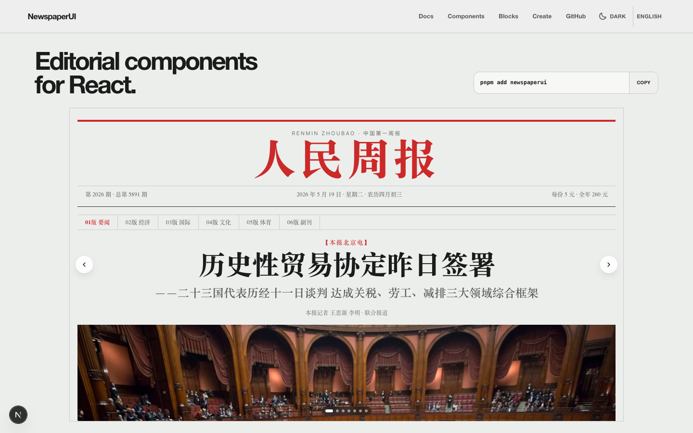

<p align="center">
  
</p>

<h1 align="center">NewspaperUI</h1>

<p align="center">Editorial React components for production newspaper layouts.</p>

<p align="center">
  <a href="https://joisun.github.io/newspaperui/">中文文档</a> ·
  <a href="https://joisun.github.io/newspaperui/en/">English docs</a> ·
  <a href="https://joisun.github.io/newspaperui/blocks/">Browse blocks</a> ·
  <a href="https://joisun.github.io/newspaperui/create/">Create a theme</a>
</p>

<p align="center">
  <a href="https://joisun.github.io/newspaperui/">
    
  </a>
</p>

NewspaperUI is a React component library for building responsive newspaper and editorial interfaces. Compose front pages, long-form stories, and multilingual publications from reusable layout, typography, and media primitives.

## Installation

```bash
pnpm add newspaperui
```

## Quick start

```tsx
import 'newspaperui/style.css';
import { Article, BodyText, Headline, Layout, Section } from 'newspaperui';

export function FrontPage() {
  return (
    <Layout columns={24}>
      <Section columns={24}>
        <Article span={16}>
          <Headline as="h1" weight="High">
            The morning edition
          </Headline>
          <BodyText columns={2} dropCap>
            <p>Compose the story with a real editorial reading flow.</p>
          </BodyText>
        </Article>
      </Section>
    </Layout>
  );
}
```

## Highlights

- Responsive composition on a 24-column editorial grid.
- Multi-column text, drop caps, rules, captions, quotes, and publication metadata.
- Typography presets for English, Chinese, Japanese, and German layouts.
- Light and dark themes, complete example editions, and a visual theme creator.

## Documentation

Visit the documentation in [中文](https://joisun.github.io/newspaperui/) or [English](https://joisun.github.io/newspaperui/en/) for component APIs, layout guides, complete editions, and theming. Both languages use stable, shareable URLs and can be switched from the site header. The repository also includes an optional [NewspaperUI agent skill](SKILL.md) for coding assistants.

## Development

```bash
pnpm install
pnpm dev
```

Before submitting changes, run:

```bash
pnpm lint
pnpm test
pnpm exec turbo run build --force
```

## License

MIT
